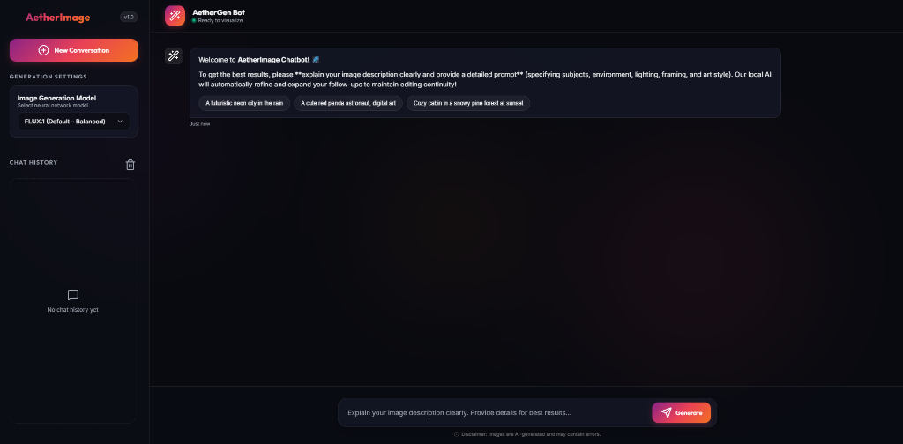

# 🌌 AetherImage - Text-to-Image Generation Chatbot

AetherImage is a modular, asynchronous, dark-mode Text-to-Image generation chatbot. It features a sleek glassmorphic UI built using **Vanilla HTML/CSS/JS** on the frontend and a high-performance **FastAPI** backend in Python.

It routes conversational dialog locally using **Ollama** (`llama3.2:latest`) for prompt classification and refinement, and connects to **Pollinations AI** and **Google Imagen 3 (via Gemini)** to render high-quality images.

---

## 📸 Interface Preview



---

## ✨ Key Features

- **🧠 Local LLM Prompt Routing & Clarification**:
  - The chatbot uses a local Ollama model to classify inputs in real time.
  - **Chit-Chat & Greetings**: Intercepts casual talk (e.g. *"hi"*, *"who are you"*, *"how are you"*) and responds textually without wasting API credits or generating blank images.
  - **Vague Prompts**: Detects vague requests (e.g. *"make a photo"*, *"draw something"*, *"wallpaper"*) and asks you to clarify details (subjects, style, lighting) before sending it to the generator.
  - **Visual Generation**: Automatically triggers generation/refinement for descriptive prompts or follow-up edits (e.g. *"add a red car"*, *"make the sky sunset orange"*).
- **🔒 Seed Consistency (Seed-Locking)**:
  - Remembers the numeric generation seed of the first image in a chat session.
  - Passes this seed to subsequent edits to lock down the composition, environment layout, and camera style, ensuring modifications are applied as seamless edits rather than completely new generations.
- **🔄 Async Prompt Refinement**:
  - Automatically compiles your conversational editing history into a detailed prompt (via Llama 3.2) to maintain context and style.
- **🛡️ Auto-Fallback Engine**:
  - *Level 1*: Google Imagen 3 (Gemini 3.1 Flash Image) if a developer API key is provided.
  - *Level 2*: Online API (Pollinations AI) rendering via Flux, Grok, and Ideogram.
  - *Level 3*: Offline SVG visual cards if network connectivity is lost.

---

## 🛠️ Technology Stack
- **Backend**: Python 3.10+, FastAPI, Uvicorn, HTTPX
- **Frontend**: HTML5, Vanilla CSS (Glassmorphism), JavaScript (ES6+), Lucide Icons
- **Local AI**: Ollama (Llama 3.2 3B)

---

## 🚀 Getting Started

### 1. Prerequisites
- **Python**: Install Python 3.10 or higher.
- **Ollama**: Download and install [Ollama](https://ollama.com/).
  - Once installed, pull the text model in your terminal:
    ```bash
    ollama pull llama3.2:latest
    ```

### 2. Installation
1. Clone or copy the repository files.
2. Navigate to the project root directory:
   ```bash
   cd C:/Users/nikhi/.gemini/antigravity/scratch/image-gen-chatbot
   ```
3. Install the Python dependencies:
   ```bash
   pip install -r requirements.txt
   ```

### 3. Configuration
Copy `.env.example` to `.env` and fill out your variables:
```ini
PORT=3000
OLLAMA_URL=http://localhost:11434
USE_OLLAMA_PROMPT_REFINEMENT=True
# OPTIONAL: Enter your Google AI Studio Gemini API Key in the frontend to enable Imagen 3 models.
```

### 4. Running Verification Tests
Execute the integration test suite to verify routing, controllers, seed-locking, and LLM classifiers:
```bash
python test_backend.py
```

### 5. Starting the Server
Start the FastAPI server:
```bash
python main.py
```
Or start via uvicorn directly:
```bash
uvicorn main:app --reload --port 3000
```

Once started, open **`http://localhost:3000`** in your browser to start generating!

---

## 📖 User Guide

### 1. Starting a Chat
Type a descriptive prompt to start, like:
> *"A cozy log cabin in a snowy pine forest at sunset."*

### 2. Modifying an Image
Ask for edits to the generated scene. The chatbot locked seed and Ollama rephraser will modify it in-place:
> *"add a glowing campfire in front"*

### 3. Vague Prompts & Chit-chat
- If you ask *"Tell me a joke"*, the bot will guide you back to describing images.
- If you say *"make a photo"*, the chatbot will ask you to specify what subject, environment, and style you prefer.
